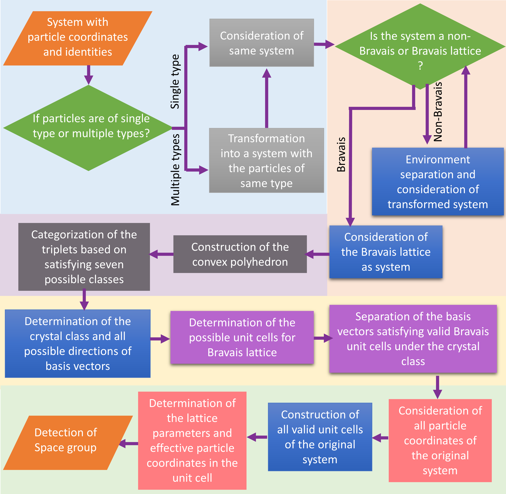
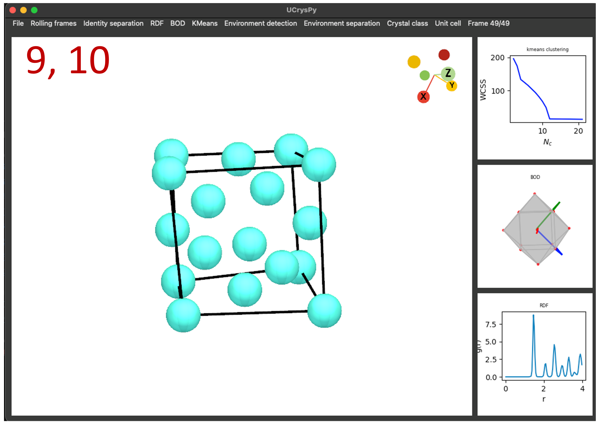

# UCrysPy
Python based visualization tool to detect the crystal structures from computer simulation data

For details, please visit arxiv link : [(https://arxiv.org/abs/2407.08808)](https://arxiv.org/abs/2407.08808)

**Contact** : 

Sumitava Kundu, **Email** - kundusumitava@gmail.com

Avisek Das, **Email** - mcsad@iacs.res.in

## Installations :

##### Requires : 

Python (>= 3.6)

There are some required python packages to be installed. Run the following command to install those.

`$ pip3 install numpy scipy matplotlib garnett freud-analysis coxeter gsd rowan scikit-learn distinctipy mpl-interactions spglib Geometry3D pyvistaqt pyvista PyQt5`

##### Install ``fresnel" (https://fresnel.readthedocs.io/) separately to render the system configuration or other images from the package directly, otherwise it results error.

##### Unzip the file

`$ unzip ucryspy.zip`

There are two files; **param_file.json** and **ucryspy.sh** along a directory called **src**, consisting of the source codes.

"**param_file.json**" - A parameter file in the JSON format to control the menus in the GUI. The maximum and minimum values can be changed in the file to calculate several things.

"**ucryspy.sh**" - A BASH script to run the GUI, where the **/src/main.py** is called.

###### To run the GUI :

`$ ./ucryspy.sh`

## Formatting the ``param_file.json'' :

The user can change the minimum and maximum values of different input parameters depending on the situation to reflect the menus in the GUI. The corresponding instructions are written as ``_comment'' key.

For example; in the **param_file.json**, **rmax_min** = 1 and **rmax_max** = 50. But the user can change the values as per requirements. The same will be reflected in the GUI.
## Menus ---

#### (1) File :

(a) Trajectory file (*) ---> Load the GSD trajectory file; read the coordinate of the particles and box. If the input file contains the shape information, the module loads the particle shapes.

(b) Quick screenshot ---> Takes screenshot of the entire window

(c) Save configure ---> Save the snapshot using Fresnel. The user can change various parameters to save the file.

(d) Save ---> Save the configuration as a PNG file

**UCrysPy is capable to load multicomponent system with different particle shapes.**

*The user should provide "y/n" (yes/no) input through a pop-up window asking whether to average over last 50 (this number can be changed depending on the requirement) frames. If the user's choice is "y", particles' position will be averaged over the trajectory enabling the particles shapes as spheres only. The user should notice that not a single coordinate in the averaged trajectory is real particle position, hence the final unit cell will also be estimated based on the averaged coordiantes. This could be useful to handle noisy crystals.*

#### (2) Rolling frames :

Change the frame of the trajectory file. By default, it reads the last frame of the trajectory

(a) Forward ---> Move forward the frame and show the configration

(b) Backword ---> Move backword the frame and show the configration

(c) Last frame ---> The configration of the last frame of the trajectory

(d) First frame ---> The configration of the first frame of the trajectory
#### (3) Identity separation :

Choose a particular type of particle identity to detect the unit cell

(a) Type - 0 --> 0

(b) Type - 1 --> 1

.

.

.

(c) Go --> Shows the configuration with specific particle identity

*If there is only one type of particles, this menu could be skipped and it won't affect the result.*

#### (4) RDF :

Calculate the radial distribution function (RDF)

(a) Bins (*) ---> Number of bins to calculate the RDF

(b) rmax (*) ---> Maximum distance to consider for RDF calculation

(c) Go (*) ---> Calculate the RDF. The user can zoom in or zoom out the plot.

(d) Save ---> Save the RDF as a PNG file

(e) Clear ---> Clear the RDF plot from the window

#### (5) BOD :

Calculate the positional distribution of the neighbors of all particles within a distance $r_{c}$, i.e. bond order diagram (BOD), which needs to be chosen from the RDF. First minima of the RDF is preferred such that the points are scattered in 3D (not in a plane).

(a) rmin (*) ---> Minimum distance to calculate the BOD. In general, rmin = 0

(b) rcut (*) ---> Cutoff distance for BOD to caculate the neighbor-list. Generally, rcut corresponds to the first minima of RDF

(c) Go (*) ---> Calculate the BOD and scatter plot in three dimensions. The user can zoom in or zoom out the plot as well as rotate in 3D.

(d) Save ---> Save the BOD as a PNG file

(e) Clear ---> Clear BOD plot from the window

#### (6) KMeans :

Use the K-Means clustering to calculate the the exact number of clusters present in the BOD by analysing the elbow.

(a) c_min (*) ---> Initial guess of minimum number of the clusters to start the K-Means. Preferebly, c_min = 2

(b) c_max (*) ---> Initial guess of maximum number of the clusters for the K-Means clustering. Keep the value  higher for the accurate determination.

(c) Go (*) ---> Apply the K-Means clustering and show a two dimensional plot of WCSS vs number of cluster. The user can zoom in or zoom out the plot.

(d) Save ---> Save the plot of WCSS vs number of the clusters as a PNG file

(e) Clear ---> Clear the plot of WCSS vs the number of clusters from the window

Choose the number of the clusters as elbow, after which value in the x-axis, the WCSS value (plotted in the y-axis) decreases almost monotonically.

#### (7) Environment detection :

Categorize the particles based on the environments. Separate the particles with similar kind of environment, if allowed by the user.

(a) elbow (*) ---> The exact number of the clusters, i.e. elbow

(b) matching (*) ---> probability of matching of the elements (cluster ids) between two arrays (consistng of the cluster ids) for two particles, to say whether the two particles have similar kind of environments. For ideal crystal without any noise, the value should be 1.0. The matching value can be chosen slightly less than 1, to detect the unit cell for very noisy crystal. The value strictly depends on the noise present in the system.

(c) Go (*) ---> detects the local environment of the particles.

* For "matching" value less than 1, please remember that there is a certain chance to consider the two different types of environments as same. A "matching" value sufficiently less than 1, can lead to the detection of a completely wrong unit cell and space group.

* It asks for an input from the user, "**Do you want to save the configuration based on the environments (y/n):**" If "y" (yes) then it categorizes the particles based on the environments and save the configuration in different colors as a PNG file using Fresnel. A particular color indicates the particles with similar kind of environment.

* "**Percentage of one kind of environment is :**" -  It shows a value in percentage of a single kind of environemnt containing maximum number of particles in the whole system. The user should take a decision by observing the percentage value, whether this is a Bravais lattice or non-Bravais lattice. For an ideal Bravais lattice, this value is 100%.

#### (8) Environment separation :

(a) Go (*) ---> Perform the environment separation.

* The user needs to enter an integer value against "Enter your choice (int) of environment id-'0' is preferred corresponding to max number of particles of single crystalline structure". For a noisy crystal, id-0 indicates one type of environment with maximum number of particles where id-1 does a single type of environment with second most number of particles and so on.

* It asks the user for a further input , "Bravais/Non-bravais (b/nb)?:" - Enter "b", if the user thinks that the considered system is a Bravais lattice depending on the percentage value or "nb" for non-Bravais lattice, which needs to be considered futher for separating the particles with similar environments. If "nb" is pressed, it considers only the coordinate of the particles with similar environment from the previous system and the rest of the particles are deleted from the system. After that, the configuration will be shown. At the same time, all the priviously calculated RDF, BOD and the plot for elbow analysis, are removed from the window as the particles having the similar environment are considered as the system in order to transform a non-Bravais lattice into a Bravais lattice.
  
### *Step-4 to step-8 should be performed iteratively, until a non-Bravais lattice turns into a Bravais lattice*

The decision depends on the user based on the percentage value after step-8 is done, whether the chosen system is Bravais or non-Bravais in nature.

The BOD and K-means plots shown in this steps, correspond to the Bravais lattice (not the original structure you consider).
#### (9) Crystal class :

Detect the direction of the lattice vectors.

(a) elbow (*) ---> The exact number of the clusters, i.e. elbow, determinded from the Bravais lattice

(b) Go (*) ---> Get the direction of the lattice vectors for the crystal class.

(c) rtol (**) ---> Distance tolerance to detect the crystal class

(d) atol (**) ---> Angle tolerance for the determination of the crystal class

* It suggestes distance and angle tolerance based on the noise present in the input data. The user can **Continue (y/n)?** with the suggested tolerance values if specific crystal class is detected.

* It will show the **detected crystal class** and an interger number as **Number of possible choice of unit cells :** - which denotes the number of possible choices of the directions corresponding the crystal class with highest order. Each of the choice may or may not be capable to construct the valid Bravais unit cell.

* If the crystal class appeares to be None, the user can change the distance and angle tolerances as two submenus **rtol** and **atol** will be active. 

* Depending on the situations, this step can take a little bit more time (few extra seconds). So be patient to execute the step.
#### (10) Unit cell :

Detect the unit cell with proper lattice parameters, all the particles in the unit cell and determine the space group.

(a) dist tol (*) ---> Distance tolerance to search the particles along the direction of the lattice vectors

(b) angle tol (*) ---> Angle tolerance to detect the particles along the direction of the lattice vectors

(c) v_factor (*) ---> Volume factor to expand the convex hull. For ideal system, "v_factor" = 0

(d) Go (*) --> Detect all the particles in the unit cell. Show the unit cell and determine the space group

(e) Save effective sites ---> Save the equivalent lattice sites as a PNG file

(f) Clear ---> Clear all the widgtes from the window and show the initial configuration again

* Chooses the reference particle randomly, and tries to get all the effective particles in the parallelepiped. If the lattice parameters and effective number of particles calculated from the system do not satisfy any valid Bravais unit cell under the detected crystal class then **the random reference particle, dummy lattice parameters (not satisfying any crystal class), Running ......** will be printed. 

* But if the lattice parameters and effective number of particles in the parallelepiped satisfy any valid Bravais unit cell proeprly, then **Lattice paramers, satisfied crystal class, the effective number of particles, the integer id of the choice of the lattice vectors --> passed** are shown on the window. The integer id will be required as an input by the user, described below.

* If no valid Bravais unit cell is satisfied by the chosen directions of the triplets, then **Lattice paramers, satisfied crystal class, the effective number of particles --> failed** are shown on the window as a unsuccessful choice of the basis vectors.

#### It consideres all the coordinates of the initial system irrespective of the Bravais or non-Bravais nature.

* The details of the unit cell of the initially considered crystal (Bravais or non-Bravais system) along with the detected space group will appear for all successful choices of the  basis vectors. Then the following prints come sequentially:

1. Details of basis vectors 'id'
2. Directions of the basis vectors
3. Lattice parameters : 'detected lattice parameters' and Crystal class : 'detected crystal class'
4. Lattice vectors : --> The actual lattice vectors (not the directions only
5. Number effective particles : --> The number of effective particles in the unit cell
6. Spacegroup : --> 'space group number' and 'spacegroup symbol' according to the notation of IUCr

* It asks the user for an input value as **Enter your choice of basis vectors (int) :** - The integer (shown on the window, as achieved for the 'passed' basis vectors) should be the choice of the user which eventually determines the lattice parameters after choosing the particles of the unit cell, after translating along the corresonding dircections from a reference particle. The choice (integer value) should be less than the total number of possible choices of the directions of the lattice vectors, calculated from the previos step (step-9).

* The user can have the option to see the unit cell for a particular choice of the basis vectors as the choice of the unit cell is not unique. Any choice of the basis vectors will lead to the same space group.

* If only one choice of the direction of the lattice vectors exists as **Number of possible choice of unit cells : 1**, the user must enter the id **0** as the choice.

* If the unit cell shown in the window after successful determination, contains any particles in red colors, that means these are the dummy particles with dummy orientations (if the vertices are provided initially in the shape JSON file; each orientation is assigned a dummy quaternion, [1, 0, 0, 0]). There are no real particles in the chosen directions of the lattice vectors (staring from a particular reference particle) within the tolerances provided by the user. If the algorithm is run again, another random particle is chosen as refernce; the user might get all the real particles with no particles in red color. It strictly depends on the noise in the real crystal system (not ideal crystal structure) and the tolerance values provided by the user.

* Prints the actual lattice vectors, total number of equivalent lattice sites with coordinates and space group number according to the international number and short name.

* Please try to the use the **2.0.2** version of the *Spglib* package. Any other version might cause many unnecessary warnings to come in but those can be ignored.

*Any submenu denoted with **\*** inside the bracket, denotes the compulsory step to execute the algorithm properly.*

*Submenus denoted with **\*\*** inside the bracket, are the compulsory steps once the user opt for different choices.*

*Please note that all the menus will not be active always during the entire session of the unit cell detection. Some of the menus are disabled to restrict the users from making certain mistakes. If the users follow the instructions properly, the menus will be activate automatically, which leads to the actual detection of the unit cell and the sapce group of the crystal.*

### Complete flowchart of UCrysPy

Step-1 --- Upload file and show the configuration

Step-2 --- Choose the frame for desired configuration to detect the unit cell

Step-3 --- Identity separation

Step-4 --- Calculate RDF

Step-5 --- Calculate BOD

Step-6 --- K-Means clustering

Step-7 --- Environment detection

Step-8 --- Environment separation

Step-9 --- Detection of crystal class

Step-10 --- Unit cell detection

### Steps to detect the crystal structure from the sample trajectory file, "cubic_diamond_traj.gsd"

The last frame of the input trajectory file corresponds to the Cubic diamond structure. The steps to detcet the unit cell are as follows.

### Instructions to reproduce the Cubic diamond unit cell as shown below:

First we need to upload the trajectory file. Click "Load file" to upload and it asks an user input "Average over frames? (y/n)". For the time being, we will only detect the unit cell from the last frame, so please type "n".

It shows "Frame 49/49" indicating the shown configuration is the last frame as we are interested in. So, no need to select the menu "Rolling frames".

As there are only single type of particles, we are not required to choose the particle type from the menu "Identity separation".

Then RDF, BOD and K-Means clustering are required to be performed consecutively.

To calculate "RDF", select "Bins"=100, "rmax"=4, and select ""Go

Then from the "BOD" menu, select "rmin"=0, "rcut"=1.1 and "Go"

From the "Kmeans" menu, select "c_min"=2, "c_max"=20 and "Go"

The screenshots corresponding upto these steps are merged and shown below.

Now, we have to detect the local environment and separate any particular type if more than one type exists.

From the "Environment detection" menu select "elbow"=8 (see the K-mans plot), "Matching"=1.0 (i.e. 100%) ad "Go".

It asks for the user input, "Enter your choice (int) of environment ....", Please enter "0" and click "OK".

Again it asks "Save Configuration? (y/n)". For the time being, choose "n" and select "OK".

From "Environment separation" menu, select "Go" which asks an user input "Bravais/Non-bravais (b/nb)?". Please notice your terminal, where it should print some output.
`Suggested distance cutoff for polyhedron:  ~ 0.01`
`Suggested angle cutoff for polyhedron:  ~ 3.57`
`Percentage of one kind of environment is :  ~ 50`
As the percentage of one kind of local environment is ~ 50%, there exists two different environments indicating the crystal is a nonbravais structure, so enter "nb" and click "OK". Please follow the instruction as shown below.

`******************ENVIRONMENT HAS BEEN SEPARATED. PLEASE RE-CALCULATE RDF, BOD, K-Means and  'ENVIRONMENT SEPARATION' again to check for the Bravais lattice *********************`

It shows the configuration by deleting the particles with different kinds of environment. Please note, it is the same system where some particles are removed. We have to calculate RDF, BOD and KMeans again.

To calculate "RDF", select "Bins"=100, "rmax"=4 and "Go". See, the nature of RDF is complete changed

From "BOD" menu, select "rmin"=0, "rcut"=1.75 (first minimum of RDF) and "GO". The nature of "BOD" is also changed

From "KMeans" menu, select "c_min"=0, "c_max"=20 and "Go", Look, the elbow is at 12.

Then from the "Environment detection" menu, select "elbow"=12 (see Kmeans plot), "matching"=1 (i.e. 100%) and select "Go".

It asks for the user input, "Enter your choice (int) of environment ....", Please enter "0" and click "OK".

Again it asks "Save Configuration? (y/n)". For the time being, choose "n" and select "OK".

From "Environment separation" menu, select "Go" which asks an user input "Bravais/Non-bravais (b/nb)?". Please notice your terminal, where it should print some output.
`Suggested distance cutoff for polyhedron: ~ 0.03`
`Suggested angle cutoff for polyhedron: ~ 2.44`
`Percentage of one kind of environment is :  ~ 100`
It asks for the user input "Bravais/Non-bravais (b/nb) ?". As the system has already turned into a Bravais structure, please select "b" resulting the system to be intact as it is.
Now, the system turned into a Bravais lattice. It's time to identify the crystal class.

To do this, from the "Crystal class" menu, select "elbow"=12 (as obtained from the last KMeans plot) and "Go".
It prints one list, such as [0, 6, 8, 6] indicating the rotational symmetry operation of the BOD where there are no $C_6$ oprations but six $C_4$, eight $C_3$ and six $C_2$ ($\times$ 2) exist.
`Detected crystal class is :  NONE`
As it shows, no crystal class has been detected within the given tolerance values. So, it is required to tune the tolearnace a little bit so that we find the probable crystal class.

It asks for an user input "Continue ? (y/n)". As no crystal class is detected, please select "n". It gives a warning as follow.
`WARNING : Please recalculate "Environment separation" with extarnal tolerance values`
To change the tolerances, go back to the "Environment separation" menu. Select "r_tol"=0.01, "a_tol"=5 and "Go". It again askas for the user input "Bravais/Non-bravais (b/nb) ?". As the transformed system is already a Bravais structure, please select "b" again. Then from "Crystal class" menu, select "elbow"=12 and "Go". Now, it prints the follwoing output.

`Detected crystal class is :  CUBIC`
`Number of possible choice of unit cells :  4`

The screenshots are shown below.

The detected crystal class is "Cubic" and the number of possible unit cells is 4. Is askes another user input, "Continue? (y/n)". Please select "y" as we will move further with the detected crystal clas. 

Now, the crystal class is successfully detceted and we are required to identify the unit cell as the final step.

From the "Unit cell" menu, select "dist tol"=0.2 (i.e. distance tolerance), "angle tol"=12 (i.e. angle tolerance), "v_factor"=0.15 (i.e. volume factor) and "Go". It prints the output and the samples are shown below.

`354 [1.998, 2.086, 2.096, 90.246, 87.186, 93.997] Running ......`
`[1.998, 2.086, 2.096, 90.246, 87.186, 93.997] CUBIC 4 0  --> passed`

Here, the format refers to the elements in the list as lattice parameters, $a$, $b$, $c$, $\alpha$, $\beta$, $\gamma$, followed by the $\textit{crystal class}$, $\textit{effective number of particles in the Bravais lattice}$ (in this case, 4), $\textit{the identity corresponding to the choice of unit cell}$, which are passed.

It asks whether to "Continue? (y/n)". As we have some lattice vectors those passed for the valid choice of lattice parameters satisfying the crystal class, please continue by entering "y", followed by anther user input asking "UC choice (int)". Now, it depends on the users which unit cell corresponding to the valid choice of lattice vectors they want to visulaize. Enter the valid integer number which signifies $\textit{the identity corresponding to the choice of unit cell}$.

Now the user could be able to see the specific details of the chosen unit cell including the space group which is $Fd\bar{3}m$ (227) for the cubic diamond crystal structure. The corresponding unit cell is ready to visualize iun the window with all particles in the unit cell.

It also prints the unit cell particles identities, which can be used to verify the correct unit cell by tracking the particle coordinates in the chosen system. The relevant screenshot is shown below.

